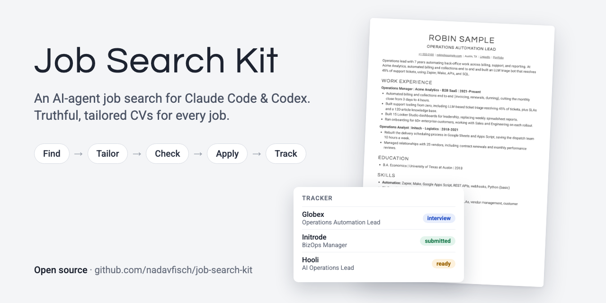

# Job Search Kit

[](https://github.com/nadavfisch/job-search-kit/actions/workflows/tests.yml)



A job search run by your AI coding agent ([Claude Code](https://claude.com/claude-code) or [Codex](https://openai.com/codex)).
It finds jobs, tailors a truthful one-page CV to each one, checks it, helps you apply, and drafts the follow-ups.
Everything runs on your machine, and your data stays in one git-ignored folder.

## What it does

1. **Setup (about 15 minutes).** You give it your CV in any format (PDF, Word, text, or your LinkedIn profile saved as PDF).
   The agent turns it into a library of your achievements, asks about anything unclear, and asks what you're
   looking for: roles, location, salary, deal-breakers. Then it shows you your first CV built by the kit.
2. **Search.** It looks in several places: LinkedIn, the job boards of the companies you want most (Greenhouse,
   Lever, Ashby, Workable, SmartRecruiters, Comeet), remote job boards, and your job-alert emails. Every new job
   gets apply / stretch / skip with a one-line reason. You approve the list.
3. **Tailor.** For each match, a CV aimed at that job: the title, the summary, which achievements come first,
   and their wording in the job's own terms. Built only from facts you approved.
4. **Check.** The code refuses to render a CV with a number that isn't in your profile, a duplicate, or anything
   you said must never appear. Then a second agent, one that didn't write the CV, reviews it for truth and fit.
5. **Apply.** With a browser agent ([Claude in Chrome](https://claude.com/chrome), or the Codex Chrome extension in
   the Codex app), it fills the application forms and uploads the right PDF. It asks before submitting, unless
   you tell it not to. Questions it has no approved answer for are collected and asked once, never made up.
   No browser agent? It hands you the link, the PDF, and every answer, ready to paste.
6. **Follow up.** It finds people on the team, drafts short connection notes and follow-ups a week later.
   You send them. Cover letters too, when a form asks for one.
7. **Keep track.** A tracker with every job's status and source, a dated log of everything that happened, a list of
   everyone you contacted, and a status report: what's waiting on you today, and which sources actually get answers.
   With Gmail connected, it reads replies from companies and updates the tracker; with a calendar, it adds
   interviews and reminders.

## Install

You need: Claude Code or Codex, Python 3.9+, Google Chrome (it renders the PDFs), and git.

Paste this into Claude Code or Codex:

```
Clone https://github.com/nadavfisch/job-search-kit here and work from that folder: install its requirements, then read SETUP.md and follow it.
```

Open your agent in the folder where you want the kit to live (your home folder is fine): it can only reach files inside
the folder it was opened in. The agent installs everything, asks for your CV, and starts asking questions. After setup,
always open your agent inside the `job-search-kit` folder, so it picks up where you left off.

Or by hand:
```
git clone https://github.com/nadavfisch/job-search-kit && cd job-search-kit
python3 -m pip install -r requirements.txt
claude        # or: codex
> set me up
```

## Using it

Just ask, in any language:
- "find me jobs"
- "apply to this job: <link or pasted description>"
- "fix the CV for Globex: lead with the billing work"
- "submit everything that's ready"
- "who should I reach out to at Globex?" / "which follow-ups are due?"
- "what's working?" / "check my email"
- "add Monday.com and Wix to my target companies"
- "this form wants a cover letter"
- "I have an interview with Globex on Tuesday"

In Claude Code there are also commands: `/job-setup`, `/job-search`, `/job-tailor`, `/job-review`, `/job-apply`,
`/job-cover-letter`, `/job-outreach`, `/job-inbox`, `/job-status`, `/job-interview`.

With many jobs at once, Claude Code tailors and reviews them in parallel subagents. For heavy use, run two sessions
side by side: one finds and prepares jobs, the other applies and follows up (`workflows/parallel.md`).

## How it stays truthful

- `my-search/profile.yaml` is your approved fact base. A CV can only use its bullets, as written or reworded.
  A reworded bullet is linked to its source, and `kit/build.py` rejects any number the source doesn't have.
- A new fact gets in only after you confirm it, and then it's in the profile for every future CV.
- Your own guardrails (`rules` in the profile): phrases that misrepresent you, levels you don't hold, bullets
  that say the same thing. The build enforces them.
- Every answer you give and every decision you make is written to a file right away, so the next session knows it too.
- A PDF a company already received is never overwritten.

## Your data

Everything about you lives in `my-search/`, which git ignores: your profile, CVs, the tracker, form answers.
Nothing is uploaded anywhere except what you submit to employers, and what your AI agent's provider processes
during the conversation, like any other chat.

## Where jobs come from

| Source | How | Notes |
|---|---|---|
| Target companies | their public job-board APIs (Greenhouse, Lever, Ashby, Workable, SmartRecruiters, Comeet) | official and stable; `kit/sources.py guess "<company>"` finds a company's board |
| LinkedIn | public job search pages | see below |
| Remote boards | Remotive API | for remote searches |
| Job-alert emails | your inbox (AllJobs, Drushim, Indeed, LinkedIn...) | needs an email connector, or paste them in |
| Anything else | `kit/add_lead.py` or paste a link | a friend's tip, a site you browse |

## LinkedIn

The search reads LinkedIn's public (logged-out) job pages, and applying uses your own browser session.
LinkedIn's User Agreement forbids automated access. The search runs logged out, so it isn't tied to your account;
applying runs in your own logged-in browser, so it is. LinkedIn restricts accounts mostly on behavior (many actions in
a row at machine speed), so the kit keeps a human pace by default: at most 15 Easy Apply a day, 5 an hour, 3 minutes
apart, and only a few profile views per job. You can change the limits. The worst likely outcome is a temporary
restriction with an identity check, but the risk to your account is yours.

## Make it yours

- **CV design**: a clean, ATS-friendly template. During setup the agent can match the look of your current CV
  (colors, fonts, alignment) in `my-search/style.css`, always as one column of text, which is what ATS systems
  read reliably. Ask it to change the look any time.
- **Hebrew, Arabic and other right-to-left CVs**: set `rtl: true` and the section `labels` in `profile.yaml`.
- **Two-page CVs**: `max_pages: 2`.
- **The process**: everything the agent does is plain Markdown in `AGENTS.md` and `workflows/`. Edit it like any document.

## Try it without setup

```
python3 kit/build.py --workspace examples/demo 1 master
```
Renders the CVs of Robin Sample, a fictional person, into `examples/demo/`.

## FAQ

**Does my CV need a specific format?** No. Any PDF, Word or text file works, and more than one version is
better. A scanned PDF (an image) works too in Claude, which can read images.

**Will it keep my CV's design?** Its look, yes, if you ask: colors, fonts and alignment carry over. Its structure, no:
two-column and sidebar layouts become one column, because ATS systems often read them out of order.

**One page or two?** One, unless you have 10+ years of experience. The text size adjusts between 9.4 and 11pt to fit,
and if the page comes out thin, the agent adds your next most relevant achievement rather than padding.

**Why does the agent keep asking for permission?** It asks before running scripts and before every browser
action. During setup it offers fewer prompts (scripts and page reading run freely) or almost none (all browser
actions), explains what each means, and saves your choice locally. Nothing is pre-approved in this repo.
One prompt can't be turned off in settings: "allow <site> for this session". Pick it once per site, per session.

**Codex or Claude Code?** Both read the same instructions (`AGENTS.md`). The differences: Claude Code has the
`/job-...` commands and runs the review in a separate subagent; in Codex, the browser extension works in the Codex
app, not the CLI.

## Development

Plain Python scripts in `kit/`, two dependencies (`pypdf`, `pyyaml`), Chrome for the PDFs. The tests cover the truth
checks, the workspace scripts, every job board's parser (offline, with faked API answers), and the PDFs end to end
through Chrome, read back the way an ATS reads them (skipped when there's no Chrome):
```
python3 -m unittest discover -s tests
ruff check && ruff format --check        # pip install ruff
```
CI runs both on Linux (Python 3.9 and 3.13) and macOS.

## License

MIT
